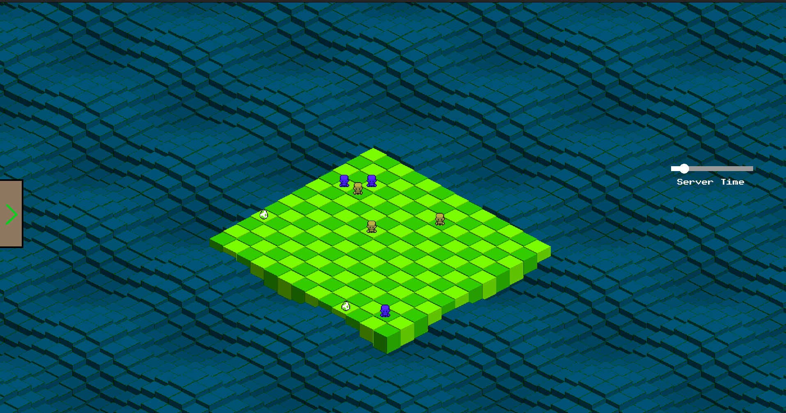

# Zappy: An AI-driven Network Game
<div align="center">
    
</div>

Goal:
-----

To create a strategic network game in which artificial intelligences collaborate as teams, competing to survive, gather resources, perform rituals, reproduce, and level up. The first AI team to reach Level 8 emerges as the victor.

The Zappy Project is segmented into three main components:

- 1️⃣ [Server](#server) : This is the backbone of the game. It facilitates seamless communication with the AI entities, ensuring that the game progresses smoothly. It also acts as a bridge between the game world and the participating AI teams, transmitting vital game-state information.
- 2️⃣ [GUI](#gui) : This visual component connects to the server, allowing users and spectators to visually track the progression of the game. It offers a dynamic representation of the game world, showcasing the activities of the AI teams and the state of the environment.
- 3️⃣ [AI](#ai) : This component, representing the 'brain' of the AI teams, automatically connects to the server. It dictates game strategies and actions based on the received data, ensuring the AI's survival and progress towards victory.

```
                           +-------------+
                           |     GUI     |
                           +------+------+
                                  |
                                  v
                +-----------+     +-----------------+     +-----------+
    User        |           |     |                 |     |           |
Input/Output<-->|   GUI     <----->     Server      <----->    AI     |
                | Interface |     |                 |     |  Client   |
                +-----------+     +-----------------+     +-----------+
                                  ^
                                  |
                           +------+------+
                           | External    |
                           | Spectators  |
                           +-------------+
```

## Installation

- Clone the repository:

```shell
git clone https://github.com/yourusername/myteams.git](https://github.com/Kcarttigueane/Zappy.git
```

- Change to the project directory:

```shell
cd Zappy
```

- Compile the project:

```shell
make
```

- Install python packages:

```shell
cd ai
pip3 install -r requirements.txt
```

# Usage

## GUI

Go to the gui folder and launch the GUI:

```shell
./zappy_gui [server_ip]? [port]?
```

- `<port>`: The port number on which the server socket listens.

## Server

Launch the server

```
./zappy_server -p port -x width -y height -n name1 name2 ... -c clientsNb -f freq
```

## AI

```
./zappy_ai -p port -n name -h machine
```

## Technical Stack

<!--ts-->

- 1️⃣ Server (zappy_server):
  - Language: C
  - Networking: Socket programming in C
- 2️⃣ GUI (zappy_gui):
  - Language: C++
  - Frontend: SFML
- 3️⃣ AI (zappy_ai): \* Language: Python
<!--te-->

# Contributors

- Kevin CARTTIGUEANE 👉 Server

<a href="https://www.linkedin.com/in/kevin-carttigueane-4798a9227/"></a>
<a href="https://github.com/Kcarttigueane"></a>

- Jules DUTE 👉 AI

<a href="https://www.linkedin.com/in/jules-dutel/"></a>
<a href="https://github.com/jvlxz"></a>

- Maxime LE BESNERAIS 👉 AI

<a href="https://www.linkedin.com/in/mlebes/"></a>
<a href="https://github.com/MaximeLeBesnerais"></a>

- Yann DEMUYT 👉 GUI

<a href="https://www.linkedin.com/in/yann-demuyt-4b890a96/"></a>
<a href="https://github.com/demisIsTired"></a>
